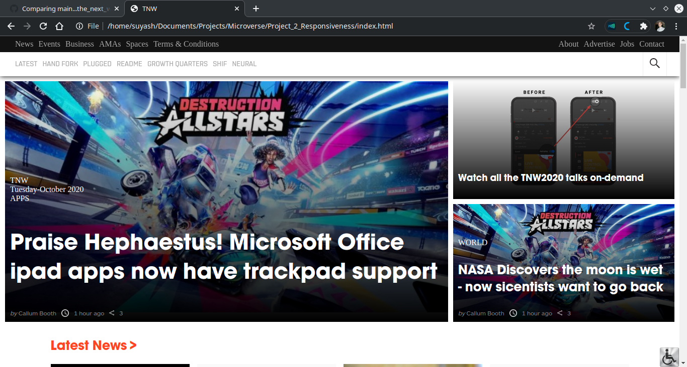

# Project_2_Responsiveness

> Second Project at Microverse to get a better understanding of Responsiveness for Websites.

## Screenshot

Screenshot: 

## Description

This project is a replica of [The Next Web page](https://www.thenextweb.com).

It is a static version. All contents (texts, images, icons and fonts) have been retrieved from the TNW website itself.

## Built With

- HTML 
- CSS
- Linter
- VScode

## Demo Link
[Live Demo Link](https://krishnzzz.github.io/Project_2_Responsiveness/)

## Contributing
Contributions, issues and feature requests are welcome! Start by:

  -  Forking the project
  -  Cloning the project to your local machine
  -  cd into the project directory
  - Run git checkout -b your-branch-name
  -   Make your contributions
  -  Push your branch up to your forked repository
   - Open a Pull Request with a detailed description to the development branch of the original project for a review

## Authors

👤 Suyash Fowdar
Github: [@Krishnzzz](https://github.com/krishnzzz)

👤 Elisha Kyakopo
Github: [@elisha2kyakopo1](https://github.com/elisha2kyakopo1)

## Show your Support
Give a ⭐ if you like this project!